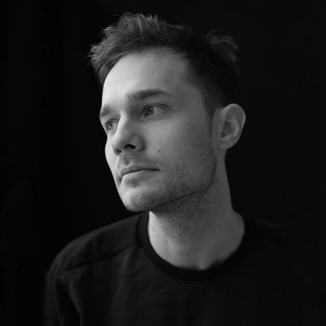

# About me

I’m an Assistant Professor at the [University of Montreal](https://dms.umontreal.ca/en/), Core Academic Member at [Mila - Quebec AI Institute](https://mila.quebec/) and a regular member of [Institut Courtois](https://institut-courtois.umontreal.ca/) developing novel methods in generative modelling, Monte Carlo methods, Optimal Transport, and applying those to solve fundamental problems in natural sciences, e.g. finding eigenstates of the many-body Schrodinger equation, simulating molecular dynamics, predicting the development of biological cells, conformational sampling, and protein folding. Previously, I did two postdocs: at [Vector Institute](https://vectorinstitute.ai/) with [Alán Aspuru-Guzik](https://www.matter.toronto.edu/basic-content-page/about-alan) and [Alireza Makhzani](http://alireza.ai); at the University of Amsterdam with [Max Welling](https://scholar.google.com/citations?user=8200InoAAAAJ).

I was born in Sevastopol, Ukraine, and at the age of 13 I started competing in Ukrainian olympiads on math and physics. Since then I’ve been interested in studying and understanding nature in all its forms from abstract (math, physics, computer science) to practical fields (history, biology, humanities, which I also try to study in my free time).

{}
**Regarding the war**
I know teachers who organized the Ukrainian Physics Olympiad when I was a kid but now fight for Ukraine with an AR in their hands. Ukraine needs help now more than ever. [Here’s a list of organizations where you can make a donation](https://standforukraine.com/).
{}

{}
**Mentoring**
I used to devote part of my time to mentoring at [Brave Generation](https://bravegeneration.org/). Regardless of your background, don't hesitate to reach out if you have any questions about research or academia.
{}

# Selected Papers
### AI for Science
---
- **Feynman-Kac Correctors: Annealing, Guidance, and Product of Experts (ICML 2025, spotlight)**\
\{Marta Skreta, Tara Akhound-Sadegh, Viktor Ohanesian\}\*, Roberto Bondesan, Alán Aspuru-Guzik, Arnaud Doucet, Rob Brekelmans, \{Alexander Tong, <ins>Kirill Neklyudov</ins>\}\*\
 
 

- **The Superposition of Diffusion Models Using the Itô Density Estimator (ICLR 2025, spotlight)**\
\{Marta Skreta, Lazar Atanackovic\}\*, Avishek Joey Bose, Alexander Tong, <ins>Kirill Neklyudov</ins>\
 
 

- **Doob's Lagrangian: Variational Approach to Transition Path Sampling (NeurIPS 2024, spotlight)**\
\{Yuanqi Du, Michael Plainer, Rob Brekelmans\}\*, Chenru Duan, Frank Noé, Carla P. Gomes, \
Alan Aspuru-Guzik, <ins>Kirill Neklyudov</ins>\
 
 

- **A Computational Framework for Solving Wasserstein Lagrangian Flows (ICML 2024)**\
\{<ins>Kirill Neklyudov</ins>, Rob Brekelmans\}*, Alexander Tong, Lazar Atanackovic,\
Qiang Liu, Alireza Makhzani\
 

- **Wasserstein Quantum Monte Carlo: A Novel Approach for Solving the Quantum Many-Body Schrödinger Equation  (NeurIPS 2023, spotlight)**\
<ins>Kirill Neklyudov</ins>, Jannes Nys, Luca Thiede, Juan Carrasquilla, Qiang Liu,\
Max Welling, Alireza Makhzani\
 

- **Action Matching: Learning Stochastic Dynamics from Samples (ICML 2023)**\
<ins>Kirill Neklyudov</ins>, Rob Brekelmans, Daniel Severo, Alireza Makhzani\
 
 
 
<!-- [[talk]](https://www.youtube.com/watch?v=35uEI5ryDRQ) -->
### MCMC
---
- **Orbital MCMC (AISTATS 2022, oral)**\
<ins>Kirill Neklyudov</ins>, Max Welling\
 

- **Involutive MCMC: a Unifying Framework  (ICML 2020)**\
<ins>Kirill Neklyudov</ins>, Max Welling, Evgenii Egorov, Dmitry Vetrov\
 

- **Deterministic Gibbs Sampling via ODEs**\
<ins>Kirill Neklyudov</ins>, Roberto Bondesan, Max Welling\
 

- **The Implicit Metropolis-Hastings Algorithm (NeurIPS 2019)**\
<ins>Kirill Neklyudov</ins>, Evgenii Egorov, Dmitry Vetrov\

### Bayesian Deep Learning
---
- **Variance Networks (ICLR 2019)**\
\{<ins>Kirill Neklyudov</ins>, Dmitry Molchanov, Arsenii Ashukha\}*, Dmitry Vetrov\
 

- **Structured Bayesian Pruning (NeurIPS 2017)**\
<ins>Kirill Neklyudov</ins>, Dmitry Molchanov, Arsenii Ashukha, Dmitry Vetrov\
 

\* *(joint main-authorship)*

# Talks
---
- [Controlling Diffusion Models at Inference Time at Chalmers AI4Science](https://youtu.be/6q7bLWOIraU?si=wCc4vcMEjTd5_GNw), 2025
- [Wasserstein Lagrangian Flows at LoGG's seminar](https://youtu.be/fTVuyPgrWGM?si=lbS1BxElGLNQNNLD), 2024
- [Action Matching talk at LoGG's seminar](https://www.youtube.com/watch?v=AdesAB80oRM), 2023
- [Action Matching talk at Shannon's Bandwagon](https://www.youtube.com/watch?v=35uEI5ryDRQ), 2023
- [Langevin dynamics for sampling and global optimization](https://www.youtube.com/watch?v=3-KzIjoFJy4), 2019
- [Sparse variational dropout and variance networks](https://www.youtube.com/watch?v=UFpy4V2ONVY), 2018

# Email
---
You can find my email in my papers.
