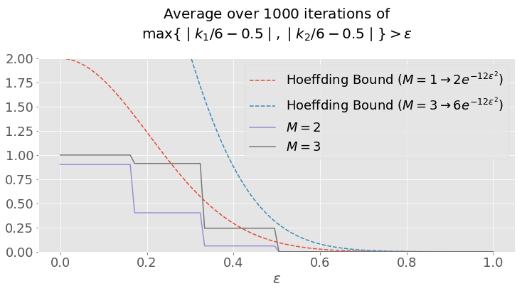

<head>
  <link rel="stylesheet" href="https://cdn.jsdelivr.net/npm/katex@0.11.1/dist/katex.min.css" integrity="sha384-zB1R0rpPzHqg7Kpt0Aljp8JPLqbXI3bhnPWROx27a9N0Ll6ZP/+DiW/UqRcLbRjq" crossorigin="anonymous">

  <!-- The loading of KaTeX is deferred to speed up page rendering -->
  <script defer src="https://cdn.jsdelivr.net/npm/katex@0.11.1/dist/katex.min.js" integrity="sha384-y23I5Q6l+B6vatafAwxRu/0oK/79VlbSz7Q9aiSZUvyWYIYsd+qj+o24G5ZU2zJz" crossorigin="anonymous"></script>

  <!-- To automatically render math in text elements, include the auto-render extension: -->
  <script defer src="https://cdn.jsdelivr.net/npm/katex@0.11.1/dist/contrib/auto-render.min.js" integrity="sha384-kWPLUVMOks5AQFrykwIup5lo0m3iMkkHrD0uJ4H5cjeGihAutqP0yW0J6dpFiVkI" crossorigin="anonymous"
      onload="renderMathInElement(document.body);"></script>
</head>


This post is a solution to the problem taken from [Abu-Mostafa, Yaser S., Malik Magdon-Ismail, and Hsuan-Tien Lin. **Learning from data.** Vol. 4. New York, NY, USA:: AMLBook, 2012.](http://www.amlbook.com).

Quoted text refers to the original problem statement, verbatim. 

For more solutions, see [dsevero.com/blog](/blog).

Consider leaving a <span style="text-shadow: none;"><a class="github-button" href="https://github.com/dsevero/dsevero.com" data-icon="octicon-star" data-size="small" data-show-count="true" aria-label="Star this on GitHub">Star</a><script async defer src="https://buttons.github.io/buttons.js"></script></span> if this helps you.

---

> A sample of heads and tails is created by tossing a coin a number of times independently. Assume we have a number of coins that generate different samples independently. For a given coin, let the probability of heads (probability of error) be \\(\mu\\). The probability of obtaining \\(k\\) heads in \\(N\\) tosses of this coin is given by the binomial distribution:
> $$ P\\left[ k \\mid N, \\mu \\right] = {N\\choose k} \\mu^k \\left(1 - \\mu\\right)^{N-k} $$
> Remember that the training error \\(\\nu\\) is \\(\frac{k}{N}\\)

The learning model used in this chapter is the following: assume you have a \\(N\\) datapoints sampled independently from some unkown distribution \\(\\mathbf{x}\_n \sim P\\), targets \\(y\_n = f(\\mathbf{x\_n})\\) and a set of hypotheses (e.g. machine learning models) \\(h \\in \\mathcal{H}\\) of size \\(\\mid \\mathcal{H} \\mid = M\\). A coin flipping experiment is used to draw conclusions on the accuracy of binary classifiers. The \\(n\\)-th flip of a coin is the evaluation of some hypothesis \\(h\\) on point \\((\\mathbf{x}\_n, y\_n)\\). Heads (numerically, 1) represents an error \\(h(\\mathbf{x}\_n) \\neq y\_n\\), while tails is a successful prediction. In the case of \\(M\\) coins, we have \\(M\\) hypotheses and \\(NM\\) data points \\((x\_{m,n}, y\_{m,n}\\))

The objective of this problem is to show that, given a large enough set of hypotheses \\(\\mathcal{H}\\), the probability of obtaining low training error on at least one \\(h \\in \\mathcal{H}\\) is high if the data is i.i.d. Therefore, we should be careful when evaluating models even if we have followed the standard train, test and validation split procedure.

How does this translate to practice? Say you have a training dataset \\(\\mathcal{D}\\) and \\(M\\) models \\(h\_m \\in \\mathcal{H}\\) that you wish to evaluate. You sample (with replacement) \\(N\\) points \\(\\mathbf{x}\_{m,n} \\in \\mathcal{D}\\) (e.g. mini-batch training) for each \\(h\_m\\) (i.e. a total of \\(NM\\) points). What is the probability that at least one hypothesis will have zero in-sample error?

> (a) Assume the sample size \\((N)\\) is \\(10\\). If all the coins have \\(\\mu = 0.05\\) compute the probability that at least one coin will have \\(v = 0\\) for the case of \\(1\\) coin, \\(1,000\\) coins, \\(1,000,000\\) coins. Repeat for \\(\\mu = 0.8\\).

Let \\(k\_m\\) be the number of heads for each coin. Since \\(\\nu=0\\) implies that \\(k=0\\), we need to calculate

$$ P\\left[ k\_1=0 \vee k\_2=0 \vee ... k\_m=0 \\right] = P\\left[ \\bigvee\\limits\_{m} k\_m = 0 \\right]$$

Here, we employ the common trick of computing the probability of the complement

Note that the following step stems from the fact that \\(\\mathbf{x}\_{m,n}\\) are independent. If we had used the same set of \\(N\\) points for all \\(h\_m\\) (i.e. \\(\\mathbf{x}\_{m,n} \\rightarrow \\mathbf{x}\_{n})\\), the set of \\(k\_m\\) would not be independent, since looking at a specific \\(k\_m\\) would give you information regarding some other \\(k\_{m^\\prime}\\).

$$ \begin{aligned} P\\left[ \\bigvee\\limits\_{m} k\_m = 0 \\right] &= 1 - P\\left[ \\bigwedge\\limits\_{m} k\_m > 0 \\right] \\\\\\ &= 1 - \\prod\\limits\_{m}P\\left[ k\_m > 0 \\right] \end{aligned} $$

Summing over the values of \\(k\\) and using the fact that \\(\\sum\\limits_{k=0}^N P\\left[k\\right] = 1\\) we can compute 

$$ \begin{aligned} P\\left[ k\_m > 0 \\right] &= \\sum\\limits\_{i=1}^N P\\left[k\\right] \\\\\\ &= \\sum\\limits\_{i=0}^N P\\left[k\\right] - P\\left[0\\right] \\\\\\ &= 1 - \\left(1 - \\mu\\right)^N \end{aligned} $$

Thus, resulting in

$$P\\left[ \\bigvee\\limits\_{m} k\_m = 0 \\right] = 1 - \\left(  1 - \\left(1 - \\mu\\right)^N \\right)^M$$

The result is intuitive. For a single coin, if \\(\\left(1 - \\mu\\right)^N\\) is the probability that **all** \\(N\\) flips result in tails, the complement \\(1 - \\left(1 - \\mu\\right)^N\\) is the probability that **at least one** flip will result in heads. For this to happen to **all** \\(M\\) coins, we get \\(\\left(  1 - \\left(1 - \\mu\\right)^N \\right)^M\\). Similarly, the probability of the complement is \\(1 - \\left(  1 - \\left(1 - \\mu\\right)^N \\right)^M\\) and can be interpretated as the probability that **at least one** coin out of \\(M\\) will have **all** flips out of \\(N\\) resulting in tails.

Let's take a look at this in python.

```python
import matplotlib.pyplot as plt
import pandas as pd

def prob_zero_error(μ: 'true probability of error',
                    M: 'number of hypotheses',
                    N: 'number of data points'):
    return 1 - (1 - (1 - μ)**N)**M

d = [{'μ': μ, 
      'M': M, 
      'p': prob_zero_error(μ, M, N=10)} 
     for μ in [0.05, 0.8] 
     for M in [1, 1_000, 1_000_000]]

pd.DataFrame(d).pivot('M', 'μ', 'p').to_html()
```

<table>
  <thead>
    <tr style="text-align: right;">
      <th>μ</th>
      <th>0.05</th>
      <th>0.5</th>
      <th>0.8</th>
    </tr>
    <tr>
      <th>M</th>
      <th></th>
      <th></th>
      <th></th>
    </tr>
  </thead>
  <tbody>
    <tr>
      <th>1</th>
      <td>0.598737</td>
      <td>0.000977</td>
      <td>1.024000e-07</td>
    </tr>
    <tr>
      <th>1000</th>
      <td>1.000000</td>
      <td>0.623576</td>
      <td>1.023948e-04</td>
    </tr>
    <tr>
      <th>1000000</th>
      <td>1.000000</td>
      <td>1.000000</td>
      <td>9.733159e-02</td>
    </tr>
  </tbody>
</table>

We've included the results for \\(\\mu = 0.5\\), which represents a reasonable error rate for an untrained binary classification model. The middle cell tells us that a sample of size \\(NM = 10^4\\) evaluated on \\(M=10^3\\) hypotheses (with \\(10\\) samples each) has a \\(62.36\\%\\) chance of at least one hypothesis having error zero.

Let's take a look at the asymptotic properties of \\(P(N,M) = 1 - \\left(  1 - \\left(1 - \\mu\\right)^N \\right)^M\\) for \\(\\mu \\in (0, 1)\\).

$$\\lim\\limits\_{M \\rightarrow \\infty} P(N,M) = 1$$
$$\\lim\\limits\_{N \\rightarrow \\infty} P(N,M) = 0$$

Intuitvely, evaluating on more datapoints \\(N\\) should make it harder for all points (coins) to have zero error (tails) for any number of hypotheses. Using a larger hypothesis set \\(\\mid\\mathcal{H}\\mid = M\\) is analogous to brute forcing the appearance of \\(k=0\\) through repetitive attempts.

If we want to bound this probability (for the sake of sanity) to some value \\(\\lambda\\), how should we chose \\(M\\) and \\(N\\)? Solving independently for \\(N\\) and \\(M\\) in \\(P(N,M) \\leq \\lambda\\)

$$M \\leq \\frac{log\\left(1 - \\lambda\\right)}{log\\left(1 - \\left(1 - \\mu\\right)^N\\right)}$$
$$N \\geq \\frac{log\\left(1 - \\sqrt[M]{1 - \\lambda} \\right)}{log\\left(1 - \\mu\\right)}$$

We can use these result to calculate how fast the number of hypotheses \\(M\\) can grow with respect to the number of datapoints \\(N\\) for a fixed probability of zero error \\(\\lambda\\), and vice-versa.

> (b) For the case \\(N = 6\\) and \\(2\\) coins with \\(\\mu = 0.5\\) for both coins, plot the probability \\(P\[ \\max\\limits\_i \\mid \\nu\_i - \\mu\_i \\mid > \\epsilon \]\\) for \\(\\epsilon\\) in the range \\(\[0, 1\]\\) (the max is over coins). On the same plot show the bound that would be obtained using the Hoeffding Inequality. Remember that for a single coin, the Hoeffding bound is $$P\[\\mid \\nu- \\mu \\mid > \\epsilon \] \\leq 2e^{-2N\\epsilon^2}$$

```python
import matplotlib.pyplot as plt
import numpy as np
plt.style.use('ggplot')

N = 6
M = 2
μ = 0.5

def hoeffding_bound(ε, N, M=1):
    return 2*M*np.exp(-2*N*ε**2)

def P(N, M, ε_space, μ):
    k = np.random.binomial(n=N,
                           p=μ,
                           size=(1_000, M))
    P = np.abs(k/N - μ).max(axis=1)
    return [(P > ε).mean() for ε in ε_space]

ε_space = np.linspace(0, 1, 100)
plt.figure(figsize=(12,5))
plt.plot(ε_space, hoeffding_bound(ε_space, N), '--',
         ε_space, hoeffding_bound(ε_space, N, M=3), '--', 
         ε_space, P(6, 2, ε_space, μ),
         ε_space, P(6, 10, ε_space, μ));
plt.title('Average over $1000$ iterations of\n'
          '$\max \{ \mid k_1/6 - 0.5 \mid,'
          '\mid k_2/6 - 0.5 \mid\} > \epsilon $\n',
          fontsize=20)
plt.legend(['Hoeffding Bound '
            '($M=1 \\rightarrow 2e^{-12\epsilon^2}$)',
            'Hoeffding Bound '
            '($M=3 \\rightarrow 6e^{-12\epsilon^2}$)',
            '$M=2$',
            '$M=3$'], fontsize=18)
plt.yticks(fontsize=18)
plt.xticks(fontsize=18)
plt.ylim(0, 2)
plt.xlabel('$\epsilon$', fontsize=20);
```


Notice how the Hoeffding Bound is violated for \\(M=3\\) if multiple hypotheses are not properly accounted for.

<!---
> [Hint: Use $P\[A\\space\\text{or}\\space B\] = P\[A\] + P\[B\] \\space \\space \\space \\space P\[A\\space\\text{and}\\space B\] = P\[A\] + P\[B\] - P\[A\] P\[B\]$, where the last equality follows by independence, to evaluate $P\[\\max \\dots \]]$.
-->


---
Questions, suggestions or corrections? Message me on [twitter](https://twitter.com/_dsevero) or create a pull request at [dsevero/dsevero.com](https://github.com/dsevero/dsevero.com)

Consider leaving a <span style="text-shadow: none;"><a class="github-button" href="https://github.com/dsevero/dsevero.com" data-icon="octicon-star" data-size="small" data-show-count="true" aria-label="Star this on GitHub">Star</a><script async defer src="https://buttons.github.io/buttons.js"></script></span> if this helps you.

---
