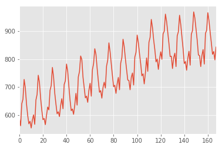
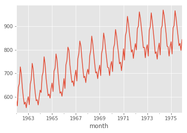
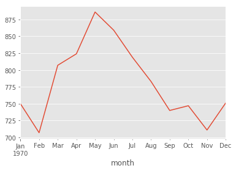
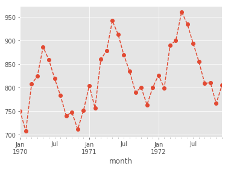
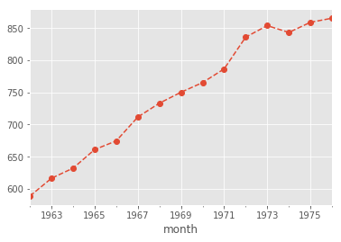
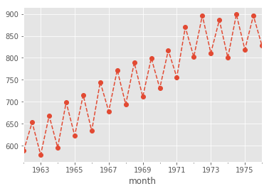
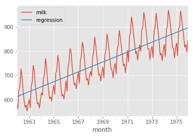

Here we will show you how to properly use the Python Data Analysis Library (pandas) and numpy. The agenda is:

1. How to load data from csv files
2. The basic pandas objects: DataFrames and Series
3. Handling Time-Series data
4. Resampling (optional)
5. From pandas to numpy
6. Simple Linear Regression

Consider leaving a <span style="text-shadow: none;"><a class="github-button" href="https://github.com/dsevero/dsevero.com" data-icon="octicon-star" data-size="small" data-show-count="true" aria-label="Star this on GitHub">Star</a><script async defer src="https://buttons.github.io/buttons.js"></script></span> if this helps you.

The following ipython magic (this is literally the name) will enable plots made by matplotlib to be rendered inside this notebook.


```python
%matplotlib inline 
```


```python
import pandas as pd
import numpy as np
import matplotlib.pyplot as plt
plt.style.use('ggplot') # changes the plotting style
```

# 1. Load data

The file `data/monthly-milk-production-pounds-p.csv` contains the average monthly milk production, in pounds, of cows from Jan/1962 to Dec/1975. More information can be found here: https://datamarket.com/data/set/22ox/monthly-milk-production-pounds-per-cow-jan-62-dec-75

First, we must load this data with pandas for further analysis.


```python
df = pd.read_csv('data/monthly-milk-production-pounds-p.csv')
```


```python
df.head()
```


<div>
<style scoped>
    .dataframe tbody tr th:only-of-type {
        vertical-align: middle;
    }

    .dataframe tbody tr th {
        vertical-align: top;
    }

    .dataframe thead th {
        text-align: right;
    }
</style>
<table border="1" class="dataframe">
  <thead>
    <tr style="text-align: right;">
      <th></th>
      <th>Month</th>
      <th>Monthly milk production: pounds per cow. Jan 62 ? Dec 75</th>
    </tr>
  </thead>
  <tbody>
    <tr>
      <th>0</th>
      <td>1962-01</td>
      <td>589</td>
    </tr>
    <tr>
      <th>1</th>
      <td>1962-02</td>
      <td>561</td>
    </tr>
    <tr>
      <th>2</th>
      <td>1962-03</td>
      <td>640</td>
    </tr>
    <tr>
      <th>3</th>
      <td>1962-04</td>
      <td>656</td>
    </tr>
    <tr>
      <th>4</th>
      <td>1962-05</td>
      <td>727</td>
    </tr>
  </tbody>
</table>
</div>


```python
type(df)
```


    pandas.core.frame.DataFrame


Calling `.head()` truncates the dataset to the first 5 lines (plus the header). Notice that the type of `df` is a pandas DataFrame. This is similar to an Excel table, but much more powerful. Since pandas is a widely used library, Jupyter automatically shows the dataframe as a formatted HTML.

# 2. The basic pandas objects: DataFrames and Series

Let's take a look at each column individually.


```python
df['Month'].head()
```


    0    1962-01
    1    1962-02
    2    1962-03
    3    1962-04
    4    1962-05
    Name: Month, dtype: object


```python
df['Monthly milk production: pounds per cow. Jan 62 ? Dec 75'].head()
```


    0    589
    1    561
    2    640
    3    656
    4    727
    Name: Monthly milk production: pounds per cow. Jan 62 ? Dec 75, dtype: int64


```python
type(df['Month'])
```


    pandas.core.series.Series


A pandas Series is the second basic type. In a nutshell, Series are made up of values and an index. For both columns, the index can be seen printed on the far left and the elements are `0, 1, 2, 3,` and `4`. The values are the points of interest (e.g. dates for the `Month` column and `589, 561, 640, 656` and `727` for the other).

A pandas DataFrame is made up of multiple Series, each representing a column, and an index.

The columns of a DataFrame can be accessed through slicing (as previously shown). Since the names are hard to write, we can change them like so:


```python
df.columns = ['month', 'milk']
```

# 3. Handling Time-Series data


```python
df.head()
```


<div>
<style scoped>
    .dataframe tbody tr th:only-of-type {
        vertical-align: middle;
    }

    .dataframe tbody tr th {
        vertical-align: top;
    }

    .dataframe thead th {
        text-align: right;
    }
</style>
<table border="1" class="dataframe">
  <thead>
    <tr style="text-align: right;">
      <th></th>
      <th>month</th>
      <th>milk</th>
    </tr>
  </thead>
  <tbody>
    <tr>
      <th>0</th>
      <td>1962-01</td>
      <td>589</td>
    </tr>
    <tr>
      <th>1</th>
      <td>1962-02</td>
      <td>561</td>
    </tr>
    <tr>
      <th>2</th>
      <td>1962-03</td>
      <td>640</td>
    </tr>
    <tr>
      <th>3</th>
      <td>1962-04</td>
      <td>656</td>
    </tr>
    <tr>
      <th>4</th>
      <td>1962-05</td>
      <td>727</td>
    </tr>
  </tbody>
</table>
</div>


```python
df.info()
```

    <class 'pandas.core.frame.DataFrame'>
    RangeIndex: 168 entries, 0 to 167
    Data columns (total 2 columns):
    month    168 non-null object
    milk     168 non-null int64
    dtypes: int64(1), object(1)
    memory usage: 2.7+ KB


The `.info()` function gives us some insight on which data-types are being used to represent the values of each column. Notice how the `milk` column is of type `int64`. Hence, we can perform arithmetic and plotting operations like so:


```python
df['milk'].plot();
```





```python
df['milk'].mean()
```


    754.7083333333334


```python
df['milk'].var()
```


    10445.764720558882


The `month` column is of type `object`. This is python's way of telling you that this column is of mixed type. Hence, it is a little bit trickier to manipulate. Due to the internals of pandas, a Series that has all values of type `str` will still be refered to as of type `object`. This is the case of the `month` column.


```python
df['month'].apply(type).unique()
```


    array([<class 'str'>], dtype=object)


The `.apply` function will apply the argument function (in this case `type`) to every single element of the series. `unique` will return to us the unique values of the series (i.e. it will drop all duplicates). Calling both together let's us see what data-types are present in the Series. As can be seen, all are of type `str`.

pandas has a built-in timestamp data-type. It works like so.


```python
pd.Timestamp('now')
```


    Timestamp('2019-10-25 14:42:25.259875')


```python
pd.Timestamp('1992-03-23')
```


    Timestamp('1992-03-23 00:00:00')


```python
pd.Timestamp('1992-03-23 04')
```


    Timestamp('1992-03-23 04:00:00')


Internally, pandas stores a date as the amount of time that has passed since `1970-01-01 00:00:00`. This date is represented as `pd.Timestamp(0)`. This is useful for linear regression, since it allows us to convert timestamp data to integers without loss of reference.


```python
pd.Timestamp(0)
```


    Timestamp('1970-01-01 00:00:00')


```python
pd.Timestamp('now') > pd.Timestamp('1992-03-23 04')
```


    True


We can transform the `month` column into `pd.Timestamp` values with `pd.to_datetime` and set it as the index of a new time-series.


```python
df['month'] = pd.to_datetime(df['month'])
```


```python
s = df.set_index('month')['milk']
```


```python
s.head()
```


    month
    1962-01-01    589
    1962-02-01    561
    1962-03-01    640
    1962-04-01    656
    1962-05-01    727
    Name: milk, dtype: int64


```python
s.index[0]
```


    Timestamp('1962-01-01 00:00:00')


```python
s.values[0]
```


    589


```python
s.plot();
```





Notice how the x-axis of the above plot differs from the first one of this same section, since the index of `s` is a timestamp-like-type. The timestamp index of `s` is also manipulatable. Time-aware slices are also now available.


```python
s.index.min()
```


    Timestamp('1962-01-01 00:00:00')


```python
s.index.max()
```


    Timestamp('1975-12-01 00:00:00')


```python
s['1970'].plot();
```





```python
s['1970':'1972'].plot(style='o--');
```





# 4. Resampling (optional)

Looking at the plots it is pretty clear that the data trend is rising, but it fluctuates yearly reaching a local peak around June. How can we calculate the yearly mean as an attempt to smooth out the data? Luckily, `s` is a time-series (i.e. has a time index and numeric values), we can use the `.resample` function. This will allow us to group the data chronologically, given that we supply an aggregating function (i.e. `mean`, `std`, `var`, `median`, etc).


```python
s.resample('12M').mean().plot(style='o--');
```





```python
s.resample('6M').mean().plot(style='o--');
```





# 5. From pandas to numpy

Numpy provides vector data-types and operations making it easy to work with linear algebra. In fact, this works so well, that pandas is actually built on top of numpy. The values of a pandas Series, and the values of the index are numpy ndarrays.


```python
type(s.values)
```


    numpy.ndarray


```python
type(s.index.values)
```


    numpy.ndarray


```python
s.head().values
```


    array([589, 561, 640, 656, 727])


```python
s.head().index.values
```


    array(['1962-01-01T00:00:00.000000000', '1962-02-01T00:00:00.000000000',
           '1962-03-01T00:00:00.000000000', '1962-04-01T00:00:00.000000000',
           '1962-05-01T00:00:00.000000000'], dtype='datetime64[ns]')


```python
s.values.dot(s.values) # dot product
```


    97434667


```python
s.values + s.values
```


    array([1178, 1122, 1280, 1312, 1454, 1394, 1280, 1198, 1136, 1154, 1106,
           1164, 1200, 1132, 1306, 1346, 1484, 1432, 1320, 1234, 1166, 1174,
           1130, 1196, 1256, 1236, 1376, 1410, 1540, 1472, 1356, 1278, 1208,
           1222, 1188, 1268, 1316, 1244, 1418, 1444, 1564, 1512, 1404, 1306,
           1230, 1242, 1204, 1270, 1354, 1270, 1472, 1510, 1622, 1596, 1470,
           1394, 1322, 1334, 1290, 1376, 1426, 1334, 1524, 1568, 1674, 1634,
           1534, 1444, 1362, 1374, 1320, 1396, 1434, 1392, 1550, 1592, 1716,
           1652, 1566, 1480, 1402, 1412, 1354, 1422, 1468, 1380, 1570, 1610,
           1742, 1690, 1602, 1528, 1450, 1446, 1380, 1468, 1500, 1414, 1614,
           1648, 1772, 1718, 1638, 1566, 1480, 1494, 1422, 1502, 1608, 1512,
           1720, 1756, 1884, 1826, 1738, 1668, 1580, 1600, 1526, 1600, 1652,
           1598, 1780, 1800, 1922, 1870, 1788, 1710, 1618, 1620, 1532, 1610,
           1642, 1546, 1766, 1796, 1914, 1848, 1762, 1674, 1568, 1582, 1520,
           1604, 1656, 1556, 1778, 1804, 1938, 1894, 1816, 1734, 1630, 1624,
           1546, 1626, 1668, 1564, 1784, 1806, 1932, 1874, 1792, 1716, 1634,
           1654, 1594, 1686])


```python
s.values * s.values
```


    array([346921, 314721, 409600, 430336, 528529, 485809, 409600, 358801,
           322624, 332929, 305809, 338724, 360000, 320356, 426409, 452929,
           550564, 512656, 435600, 380689, 339889, 344569, 319225, 357604,
           394384, 381924, 473344, 497025, 592900, 541696, 459684, 408321,
           364816, 373321, 352836, 401956, 432964, 386884, 502681, 521284,
           611524, 571536, 492804, 426409, 378225, 385641, 362404, 403225,
           458329, 403225, 541696, 570025, 657721, 636804, 540225, 485809,
           436921, 444889, 416025, 473344, 508369, 444889, 580644, 614656,
           700569, 667489, 588289, 521284, 463761, 471969, 435600, 487204,
           514089, 484416, 600625, 633616, 736164, 682276, 613089, 547600,
           491401, 498436, 458329, 505521, 538756, 476100, 616225, 648025,
           758641, 714025, 641601, 583696, 525625, 522729, 476100, 538756,
           562500, 499849, 651249, 678976, 784996, 737881, 670761, 613089,
           547600, 558009, 505521, 564001, 646416, 571536, 739600, 770884,
           887364, 833569, 755161, 695556, 624100, 640000, 582169, 640000,
           682276, 638401, 792100, 810000, 923521, 874225, 799236, 731025,
           654481, 656100, 586756, 648025, 674041, 597529, 779689, 806404,
           915849, 853776, 776161, 700569, 614656, 625681, 577600, 643204,
           685584, 605284, 790321, 813604, 938961, 896809, 824464, 751689,
           664225, 659344, 597529, 660969, 695556, 611524, 795664, 815409,
           933156, 877969, 802816, 736164, 667489, 683929, 635209, 710649])


The above examples are just for show. You can do the same thing directly with pandas Series objects and it will use numpy behind the scenes.


```python
s.dot(s) == s.values.dot(s.values)
```


    True


# 6. Simple Linear Regression.

Side note: python accepts non-ascii type characters. So it is possible to use greek letters as variables. Try this: type in `\alpha` and press the TAB key in any cell.


```python
α = 1
β = 2
α + β
```


    3


Here we will implement a simple linear regression to illustrate the full usage of pandas with numpy. For a single variable with intercept: $y = \alpha + \beta x$, the closed form solution is: 

$$\beta = \frac{cov(x,y)}{var(x)}$$
$$\alpha = \bar{y} - \beta \bar{x}$$

where $\bar{y}$ and $\bar{x}$ are the average values of the vectors $y$ and $x$, respectively.


```python
y = s
x = (s.index - pd.Timestamp(0)).days.values
```


```python
β = np.cov([x,y])[0][1]/x.var()
α = y.mean() - β*x.mean()
```


```python
α
```


    776.0355721497116


```python
β
```


    0.05592981987998409


```python
(
    s
    .to_frame() # transforms s back into a DataFrame
    .assign(regression = α + β*x) # creates a new column called regression with values α + β*x
    .plot() # plots all columns
);
```





The above programming style is called method chaining, and is highly recommended for clarity.
